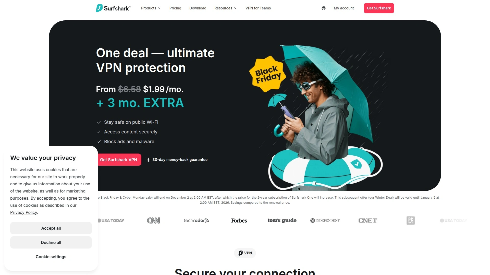
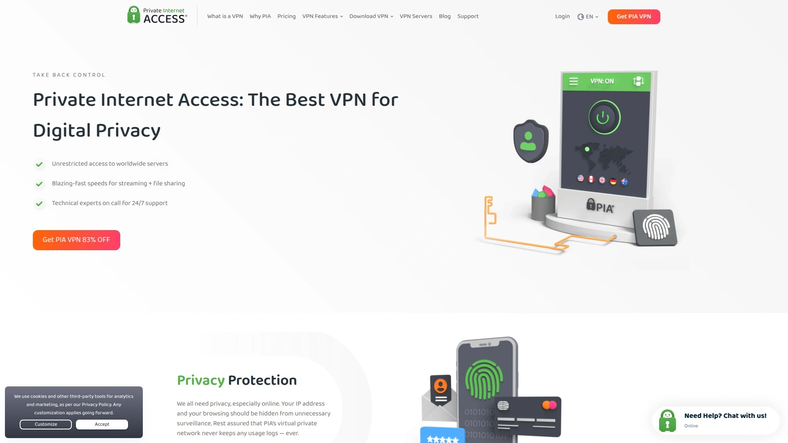

# Best 12 VPN Services in 2025 (Latest Updated)

Looking for a reliable VPN to protect your online privacy while streaming your favorite shows? Whether you're concerned about ISP tracking, need to access geo-restricted content, or simply want military-grade encryption for everyday browsing, choosing the right VPN can feel overwhelming. The good news is that today's VPN landscape offers solutions for every budget and use case—from budget-friendly options starting under $2/month to premium services with advanced security features.

---

## **[Ivacy VPN](https://ivacy.com)**

Affordable VPN pioneer offering split tunneling innovation and dedicated streaming servers at budget-friendly pricing.

Founded in 2007, this Singapore-based provider revolutionized the industry by introducing split tunneling technology back in 2010. The service maintains an extensive network spanning multiple continents with specialized servers optimized for different purposes.

**Core Protection and Protocols**

Military-grade AES-256 encryption forms the foundation, supported by multiple protocol options including WireGuard for modern devices. The secure download feature actively scans files for malware during transfers, adding an extra protection layer beyond standard VPN functionality. Users can configure split tunneling on Windows and Android to route specific apps through the encrypted tunnel while others access the internet directly.

**Server Infrastructure**

The network encompasses thousands of servers across numerous countries, providing broad geographic coverage for accessing regional content. Dedicated streaming servers exist for major platforms, though some users report occasional connection drops that require server switching. The multiport feature automatically selects optimal ports to maintain stable connections even in restrictive network environments.

**Privacy and Logging**

Based in Singapore, outside major surveillance alliances, the provider maintains a strict no-logs policy verified through its privacy documentation. The service doesn't track browsing history, connection timestamps, or original IP addresses—only minimal account information necessary for service delivery.

**Pricing Accessibility**

Monthly plans start at competitive rates, but the real value emerges with long-term commitments. Five-year subscriptions drop to approximately $1-2 per month, making this one of the most budget-conscious options available. The 30-day money-back guarantee allows risk-free testing.

**Mobile and Desktop Experience**

Apps are available for all major platforms with straightforward interfaces. The Windows client offers the most features, while Mac and iOS versions lack certain capabilities like kill switches. Connection modes simplify server selection by purpose—choose streaming, downloading, or unblocking modes rather than manually picking servers.

**Ideal Scenarios**

Best suited for budget-conscious users prioritizing value over cutting-edge features, families needing affordable protection across multiple devices, and streamers who occasionally access different regional libraries without requiring 100% consistency.

---

## **[NordVPN](https://nordvpn.com)**

Industry-leading VPN combining exceptional speeds with comprehensive security through proprietary NordLynx protocol.

This Panama-based giant operates one of the largest server networks globally, consistently ranking among top performers in independent speed tests. The company has invested heavily in security audits and infrastructure improvements following a minor 2019 server incident that actually demonstrated their no-logs claims held up under scrutiny.

The proprietary NordLynx protocol, built on WireGuard foundations, delivers speeds that rarely slow connections by more than 5-10% in testing. Threat Protection Pro actively blocks malware, trackers, and intrusive ads even when the VPN isn't connected. The obfuscated servers help bypass censorship in restrictive countries, while specialty P2P servers optimize torrenting performance across 110+ countries.

RAM-only server technology ensures no data persists after reboots. Double VPN routes traffic through two servers for additional anonymity layers. The meshnet feature enables secure direct connections between devices, useful for remote access scenarios without exposing machines to the public internet.

Plans start around $3-4 monthly for two-year subscriptions. Apps feel polished across Windows, Mac, iOS, and Android with consistent interfaces. The kill switch works reliably, and split tunneling allows granular control over which apps use the encrypted tunnel. Customer support responds quickly via 24/7 live chat.

For users wanting premium performance without compromise, this service delivers on speed, unblocking capability, and security depth. Strong choice for serious streamers, remote workers handling sensitive data, and households protecting multiple devices with one subscription.

---

## **[Surfshark](https://surfshark.com)**

Value champion offering unlimited device connections and premium features at remarkably low subscription costs.

This Netherlands-based provider disrupted the market by removing device limits entirely—connect as many gadgets as needed with one account. The pricing undercuts most competitors while maintaining quality comparable to services costing twice as much.

Beyond basic encryption and no-logs practices, Surfshark includes CleanWeb for blocking ads and trackers, Bypasser for flexible split tunneling, and MultiHop for routing through multiple countries simultaneously. The NoBorders mode helps maintain connectivity in restrictive regions by detecting firewalls and automatically switching to specialized servers.

Connection speeds hold up well for streaming HD and 4K content. The network covers 100+ countries with 3,200+ servers. While the server count is smaller than some competitors, performance remains consistent. All servers support P2P traffic, eliminating the need to find specific torrenting-friendly locations.

The Surfshark One bundle adds antivirus protection, breach monitoring, and private search engine access. Two-year plans drop prices to approximately $2 monthly. New users can test the service with a 7-day free trial across all platforms, plus a 30-day refund window.

Apps maintain clean, intuitive designs across platforms. The iOS and Android versions include GPS location spoofing, useful for location-based apps. Customer support handles issues promptly via live chat.

Perfect for families or users with extensive device collections, budget-minded shoppers refusing to sacrifice quality, and those wanting comprehensive security beyond just VPN encryption.

---

## **[ExpressVPN](https://expressvpn.com)**

Premium service emphasizing user-friendly design, consistent reliability, and broad device compatibility across platforms.

British Virgin Islands jurisdiction provides strong privacy protections. The provider operates over 3,000 servers across 94 countries with 160+ cities, offering exceptional geographic granularity for users needing specific locations.

The proprietary Lightway protocol achieves excellent speed-to-security balance, often matching or exceeding WireGuard performance. TrustedServer technology runs servers entirely in RAM, erasing all information with every reboot. Independent audits verify no-logs claims and application security regularly.

MediaStreamer (Smart DNS) extends VPN benefits to devices that don't natively support VPN apps, like certain smart TVs and game consoles. The browser extensions for Chrome and Firefox offer lightweight protection without running the full desktop client. Split tunneling works smoothly on Windows, Mac, and Android.

Network Lock (kill switch) prevents leaks if connections drop. Threat Manager blocks trackers and malicious sites. The Aircove router comes pre-configured with ExpressVPN, protecting entire networks without individual device configuration.

Pricing sits higher than most alternatives, starting around $5-8 monthly depending on plan tier. The investment buys exceptional customer support, consistent streaming performance, and apps that beginners find approachable without overwhelming them. Advanced users appreciate the configuration options buried beneath the simple interface.

Setup takes minutes across any platform. Live chat support responds knowledgeably 24/7. The 30-day refund period provides ample testing time.

Best for less technical users wanting set-and-forget simplicity, expatriates needing reliable international connections, and professionals willing to pay premium prices for premium service.

---

## **[Private Internet Access](https://privateinternetaccess.com)**

Transparency-focused VPN with court-proven no-logs policy and industry-leading customization options for power users.

This US-based provider has twice faced legal demands to provide user data—and twice proven their logs don't exist to hand over. The court cases demonstrated their privacy commitments withstand real-world pressure.

The server network is massive, with 35,000+ servers across 84 countries. This density helps avoid congestion even during peak usage times. All servers run on RAM-only hardware, enhancing privacy guarantees. Users can configure encryption strength, authentication methods, and protocol choices to optimize for their specific needs.

MACE feature blocks ads, trackers, and malware at the DNS level. Split tunneling supports fine-grained control—choose which apps tunnel through the VPN and which access the internet directly. Port forwarding enhances torrenting speeds by accepting incoming connections.

The interface appears cluttered compared to streamlined competitors, but this reflects the depth of options available. Tech-savvy users appreciate the control; beginners might feel overwhelmed initially. Performance is solid though not class-leading, with speeds suitable for HD streaming and large file transfers.

Three-year plans drop pricing to approximately $2 monthly, making this one of the best value propositions for long-term subscribers. Simultaneous connection limits are unlimited—protect every device you own. The 30-day refund window reduces purchase risk.

Customer support quality varies, with live chat available but occasionally slow. The knowledge base covers most common scenarios adequately for self-service troubleshooting.

Ideal for privacy advocates valuing transparency and court-proven claims, advanced users wanting granular configuration control, and budget-conscious shoppers committing to multi-year subscriptions.

---

## **[ProtonVPN](https://protonvpn.com)**

Swiss-based privacy specialist from the team behind ProtonMail, offering strong security and transparency practices.

The company operates under Switzerland's famously strict privacy laws, providing one of the strongest jurisdictional protections available. All applications are open-source, allowing independent security researchers to audit code for vulnerabilities. Regular third-party security audits verify both the software and privacy practices.

Secure Core architecture routes traffic through multiple servers in privacy-friendly countries before reaching the final destination. This protects against network-based attacks and traffic correlation. The NetShield feature blocks ads, malware, and trackers. VPN Accelerator improves speeds on distant servers by optimizing transmission protocols.

The free plan imposes no data caps—genuinely unlimited bandwidth, though speeds are limited and server choices restricted to three countries. This makes it one of the few truly usable free VPNs for regular browsing. Paid plans unlock the full server network, faster speeds, and simultaneous device support for up to 10 connections.

Plans start around $4-5 monthly for annual subscriptions. The Plus tier includes all features most users need. Proton Unlimited bundles the VPN with ProtonMail, ProtonDrive, and ProtonCalendar for users building a comprehensive privacy-focused ecosystem.

Performance is respectable though not fastest, with speeds adequate for HD streaming. The server network covers 60+ countries. Apps feature clean designs across all major platforms. P2P support exists on designated servers.

Customer support operates through tickets and email rather than live chat, potentially slower for urgent issues. The knowledge base is comprehensive, and the community forums provide peer assistance.

Best suited for privacy-conscious users wanting maximum transparency, those building integrated Proton ecosystem protections, and anyone needing a genuinely capable free VPN option.

---

## **[CyberGhost](https://cyberghostvpn.com)**

User-friendly service featuring specialized servers for specific activities and extended money-back guarantee period.

Romanian jurisdiction sits outside major intelligence alliances. The provider operates 9,500+ servers across 91 countries—one of the largest networks available. Servers are purpose-categorized: streaming servers for specific platforms, torrenting-optimized servers, and gaming servers to reduce latency.

NoSpy servers, operated exclusively by CyberGhost in Romania, provide extra privacy assurance since the company controls the hardware directly. Automatic kill switch protection activates across all platforms. DNS and IP leak protection comes standard.

The interface simplifies server selection through purpose-based browsing. Instead of scrolling through country lists, users can navigate to "For Streaming," select their desired platform, and connect to an optimized server automatically. This approach helps beginners avoid confusion while experienced users still have manual selection options.

Speed performance varies by server but generally supports HD streaming without buffering. The network size means users can usually find a fast, uncongested server nearby. All servers support P2P traffic.

Pricing is competitive on long-term plans, with two-year subscriptions dropping to approximately $2-3 monthly. The 45-day money-back guarantee is among the longest offered, providing extra time for thorough testing. Simultaneous connections support 7 devices.

Customer support provides 24/7 live chat with generally knowledgeable responses. Apps are available for all major platforms with consistent functionality. The browser extensions offer lightweight protection for Firefox and Chrome.

Ideal for beginners wanting simplified server selection, streamers focusing on specific platforms, and users preferring extended trial periods before committing long-term.

---

## **[Mullvad VPN](https://mullvad.net)**

Privacy-maximalist service requiring no personal information and accepting anonymous payment methods including cash.

Swedish provider takes anonymity to extremes. Account creation requires no email address, no username—just a randomly generated 16-digit account number. Payment options include cryptocurrency and actual physical cash mailed to their office. The company publishes detailed transparency reports and operates with unusual openness about infrastructure.

The flat pricing structure charges €5 monthly regardless of subscription length. No discounts for long-term commitments, no tiered plans—everyone pays the same. This simplicity extends to features: all subscribers get identical access and capabilities.

Server network is smaller at 600+ servers across 48 countries, but performance often outpaces larger competitors thanks to careful server quality control. All servers are physical (no virtual locations) and many run on bare metal hardware owned by Mullvad. RAM-only operation ensures no data persists.

WireGuard is the default protocol, delivering excellent speeds. OpenVPN remains available for compatibility. The Bridge mode uses Shadowsocks proxy to evade deep packet inspection in restrictive environments. Split tunneling and kill switch work reliably.

Five simultaneous connections are permitted per account. Apps are clean, functional, and open-source across Windows, Mac, Linux, iOS, and Android. Advanced users appreciate the technical transparency and configuration options. The CLI tools satisfy power users wanting scriptable automation.

Customer support operates through email tickets and web forms rather than live chat. Response times are reasonable though not instant. The website contains detailed technical documentation for self-sufficient users.

Best for privacy purists wanting maximum anonymity, users in high-risk situations requiring genuine privacy protection, and technically-inclined subscribers appreciating transparency over marketing polish.

---

## **[IPVanish](https://ipvanish.com)**

US-based service with strong torrenting support and unlimited simultaneous connections.

Tier-1 network ownership means the company controls its own infrastructure rather than renting servers. This provides better security oversight and performance optimization. The network spans 90+ countries with 2,400+ servers.

WireGuard, OpenVPN, and IKEv2 protocols provide flexibility. SOCKS5 proxy is available for torrent clients wanting faster speeds with less encryption overhead. All servers support P2P traffic without restrictions. Connection speeds are competitive, often matching premium providers in testing.

The VIPRE Advanced Security suite bundles antivirus, password manager, and identity theft monitoring with higher-tier VPN plans. Cloud storage adds another layer to the security package for users wanting comprehensive protection.

Unlimited simultaneous connections protect every device in a household. Apps work across all major platforms with straightforward interfaces. Split tunneling allows selective routing. The kill switch prevents accidental exposure during connection drops.

Pricing is moderate, with annual plans around $3-4 monthly. The 30-day refund window provides adequate testing time. Customer support offers 24/7 live chat with generally helpful responses.

Streaming performance is inconsistent—some services block IPVanish reliably while others work fine. This variability makes it less suitable as a primary streaming solution compared to specialized competitors. For general privacy and torrenting, however, it performs admirably.

Best suited for torrent enthusiasts wanting P2P-friendly infrastructure, families protecting numerous devices with unlimited connections, and users seeking bundled security solutions beyond just VPN functionality.

---

## **[Windscribe](https://windscribe.com)**

Canadian provider offering generous free tier and flexible Build-a-Plan customization for budget-conscious users.

The free plan includes 15GB monthly data (10GB with email verification plus 5GB for social media engagement), making this one of the most usable free VPNs available. Access to 10+ locations in the free tier provides meaningful geographic options without requiring payment.

The unique Build-a-Plan pricing lets users pay $1 monthly per location rather than subscribing to the full network. Need just US and UK servers? Pay $2 monthly total. This granular approach saves money for users with specific location needs. Unlimited data plans start around $5.75 monthly.

R.O.B.E.R.T. is Windscribe's customizable content blocker, allowing users to block ads, trackers, malware, social networks, gambling sites, or adult content at the DNS level before data even reaches devices. The browser extensions add anti-tracking features and cookie blocking beyond standard VPN functionality.

Servers span 130+ locations across 69 countries. Performance is solid though not exceptional, with speeds adequate for HD streaming. Windflix servers specifically optimize for streaming services. The network supports unlimited simultaneous connections, protecting every device simultaneously.

Double-hop connections route through multiple servers for additional privacy. Split tunneling works on desktop apps. The kill switch prevents leaks, though some users report occasional inconsistencies. WireGuard provides fast encryption while OpenVPN and IKEv2 remain available alternatives.

Customer support operates through ticket system and social media rather than live chat, potentially causing delays for urgent issues. The knowledge base covers common scenarios adequately. The 3-day money-back guarantee is unusually short compared to industry standard 30 days.

Best for users wanting to test VPN services with substantial free data, budget-minded subscribers needing only specific geographic locations, and privacy-conscious individuals appreciating customizable content filtering.

---

## **[TunnelBear](https://tunnelbear.com)**

Beginner-friendly service emphasizing simplicity through playful design and straightforward functionality.

The bear-themed interface makes VPN usage feel less intimidating for newcomers. Visual map shows your bear digging tunnels to honeypot server locations, providing intuitive representation of the connection process. This approachability sacrifices some advanced features power users expect.

GhostBear mode obfuscates VPN traffic to appear as regular HTTPS connections, helping bypass VPN detection and censorship. VigilantBear (kill switch) blocks internet access if the VPN drops. The network covers 47 countries with physical servers in every location—no virtual servers.

Independent security audits verify privacy claims annually. The company publishes detailed transparency reports showing government data requests and how they were handled. McAfee's 2018 acquisition raised initial privacy concerns, but operations have continued without apparent policy changes affecting user privacy negatively.

The free plan provides 2GB monthly data—sufficient for occasional secure browsing but inadequate for streaming or heavy usage. Paid plans start around $10 monthly or $60 annually, with unlimited data and access to all server locations. Five simultaneous connections are supported.

Apps are exceptionally simple across Windows, Mac, iOS, and Android. Setup takes seconds, and daily operation requires minimal thought—just toggle the connection on and relax. This simplicity means fewer configuration options for advanced users wanting granular control.

Speeds are adequate though not exceptional, usually supporting HD streaming without major buffering. The smaller server network occasionally results in congested connections during peak times. Customer support responds through email and help center articles rather than live chat.

Best suited for VPN newcomers intimidated by technical complexity, casual users wanting basic privacy for public Wi-Fi, and anyone appreciating fun design making security tools feel less boring.

---

## **[Hotspot Shield](https://hotspotshield.com)**

Free-tier pioneer offering ad-supported basic service alongside premium paid plans.

The free version provides 500MB daily data (roughly 15GB monthly), supporting one device with access to virtual server locations. Ads appear within the free app to support operational costs. Performance on free tier is adequate for basic browsing though speeds are intentionally capped to encourage premium upgrades.

Premium plans remove ads, unlock faster speeds, and provide access to the full server network across 80+ countries. The proprietary Hydra Catapult protocol optimizes connection speeds, particularly on mobile networks. Independent testing shows strong performance for streaming and general browsing.

Military-grade encryption protects data transmission. The kill switch prevents exposure during disconnections. No-logs policy means browsing history and connection details aren't retained. US jurisdiction raises privacy concerns for some users compared to providers in more privacy-friendly countries.

Split tunneling allows selective VPN routing on desktop platforms. Auto-pilot feature blocks malicious websites and phishing attempts. The browser extension provides lightweight protection without running full apps.

Premium plans start around $8 monthly for annual subscriptions. Unlimited device connections mean one account protects your entire household. The 45-day money-back guarantee matches the longest refund windows available.

Apps work across major platforms with generally smooth functionality. Customer support provides email assistance and live chat during business hours. The knowledge base covers common issues adequately for self-service problem solving.

Ideal for users wanting to test VPN functionality before committing financially, mobile users needing occasional secure connections on limited data, and budget shoppers willing to accept ads in exchange for free protection.

---

## **FAQ**

**Q: Which VPN offers the best value for long-term subscriptions?**

Services like Ivacy, Surfshark, and Private Internet Access consistently offer the strongest price-to-feature ratios when committing to two-year or longer plans. These providers drop monthly costs to $1-2 while maintaining solid security, decent speeds, and adequate server networks. The key is confirming the money-back guarantee provides sufficient testing time before the long commitment locks in.

**Q: Can I use a VPN to access streaming services from different countries?**

Most modern VPNs unblock major streaming platforms, though consistency varies. NordVPN and ExpressVPN demonstrate the highest reliability across Netflix, Disney+, BBC iPlayer, and other services. Some providers like Ivacy and CyberGhost offer dedicated streaming servers optimized for specific platforms. Remember that bypassing geographic restrictions may violate streaming platform terms of service, so review those policies before proceeding.

**Q: What's the difference between free and paid VPN services?**

Free VPNs typically impose data caps, speed limitations, restricted server access, and fewer simultaneous connections. Some free services like ProtonVPN offer unlimited data but limit speeds and server choices. Others like Windscribe provide generous monthly data allowances. Paid VPNs remove these restrictions while adding advanced features like kill switches, split tunneling, and better streaming support. For daily use, paid services generally provide significantly better experiences.

---

## **Conclusion**

Choosing the right VPN depends on matching features to your specific needs—streamers prioritize unblocking capability and speed, privacy advocates focus on jurisdiction and logging policies, while budget-conscious users balance cost against feature sets. The services listed above represent quality options across various price points and use cases.

For users seeking exceptional value without sacrificing essential features, **[Ivacy VPN](https://ivacy.com)** stands out with its budget-friendly pricing and pioneering split tunneling technology. The combination of dedicated streaming servers, strong encryption standards, and affordable long-term plans makes it particularly suitable for families and casual users wanting reliable protection without premium price tags. While it may not match top-tier providers in every category, the service delivers solid performance where it counts most for everyday users.

Test several options using money-back guarantees before committing long-term. Your specific location, intended use cases, and technical comfort level should guide the final decision more than any single recommendation.
